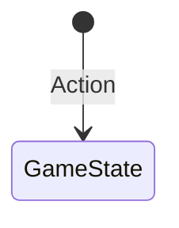

# State Transition Activity

## Objective
The goal of this project is to create a state transition diagram for a theoretical gaming company's player character movement system. This system uses a state machine to manage different player movements. After creating the diagram, you will write positive test cases for the actions that transition between each state. As a stretch goal, you can develop negative test cases as well.

## Requirements
The state machine should facilitate the following movements:
- **Idle (default)**
- **Moving**
- **Jumping**
- **Dashing**

### State Transition Rules:
- Players can switch between **Idle**, **Moving**, and **Jumping** freely.
- Players can only **Dash** if they are in the **Moving** state.
- **Dashing** can transition back to **Moving** or **Idle**.

## Instructions
### Define the State Transition Diagram:
1. Identify the states you must manage
2. Determine how players can transition between states based on the rules provided
3. Use a diagramming tool to visually represent the states and transitions

### Think of Positive Test Cases:
- Using your visual diagram of the state and possible transitions, write out positive test cases that could be used to validate state transition
- test cases should include the following information:
    - name
    - preconditions
    - action taken
    - expected outcome

### Stretch Goal: Think of Negative Test Cases:
- Using your visual diagram of the state and possible transitions, write out negative test cases that could be used to validate the constraints of state transition

### Example Initial Diagram

