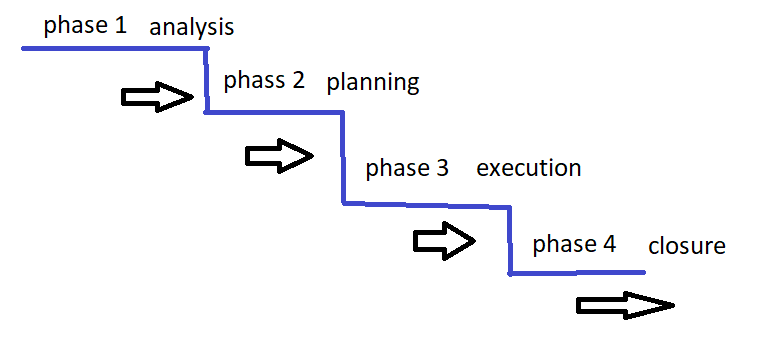
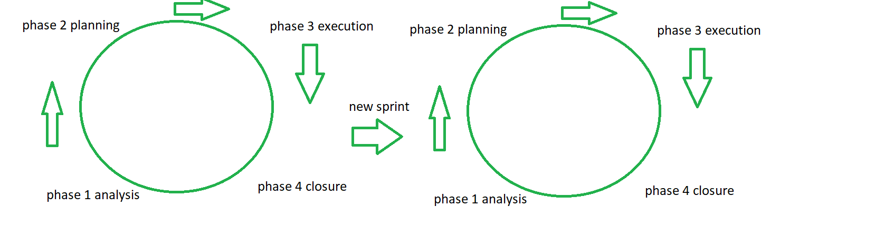

# Agile

## The old way: Waterfall
Waterfall is primarily identified as a methodology where work/progress only moves forward. It is a methodology focused on getting things done right the first time: this means there are copious amounts of documentation, legal agreements, and scheduling involved in waterfall work.

## The modern way: Agile
- Individuals and Interactions over Process and Tools
- Working Software over Comprehensive Documentation
- Customer Collaboration over Contract Negotiation
- Responding to Change over Following a Plan

Agile methodologies typically have 3 common features:
1. Dynamic Project Scopes
2. Iterative Development Cycles
3. Copious use of Automation Tools

## Agile Terminology
- **Epic**
    - A term used to describe related functionality
        - based on model/entity
        - based on available actions
        - based on general feature
        - etc
    - examples: 
        - Epic User Features
        - Epic Registration
        - Epic Planet features
        - Epic Celestial Entities
- **User Story**
    - a term that should be an easy to understand description of a feature or action an actor can take with your application
    - the more specific a User Story the easier to understand it will be for all parties involved
    - Examples:
        - "As a User I want to Register with the Planetarium so that I can log planets and moons I discover"
            - pattern: As a... I want... So that...
        - "As a User I want to log in to my Planetarium account so that I can manage my discoveries"
    - User Stories are typically grouped into Epics
- **Story Points**
    - Story Points are arbitrary values assigned to User Stories to help determine how much time/effort/cost is required to complete work on the User Story
        - can be complex like using a fibonacci sequence to determine time, or it can be simple like assigning a value based on the number of use cases needed to test the user story
- **Velocity**
    - if Story Points are your estimations for time/effort/cost to complete work on a User Story, Velocity is the actual number of Story Points completed in a work Cycle
    - Velocity can be used to assess how accurate your assignment of Story Points is
        - if your velocity decreases as your work cycles progress it is an indicator that something is going wrong with your work: your Story Point estimations are off, or your team is not working as efficiently as expected
- **Sprint**
    - Sprint is the term used to represent a single work cycle
    - Each iteration of an Agile work cycle is called a Sprint

